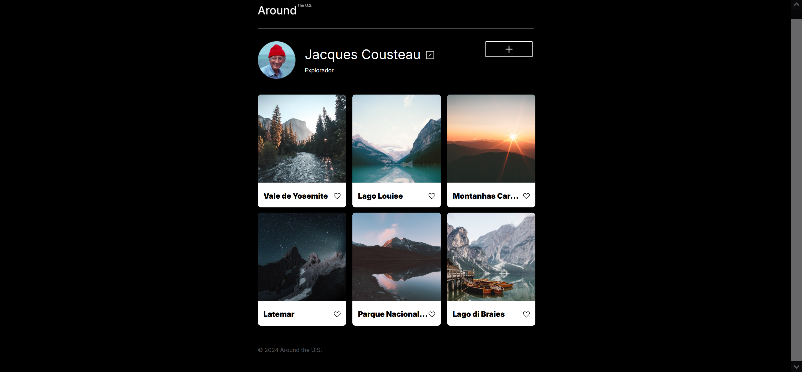
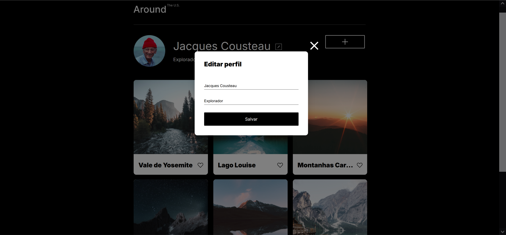

# Tripleten web_project_around

<h1 align="center">
  
  
</h1>
 
- Projeto referente a Sprint 11 do curso TripleTen, com o objetivo de colocar em prática novos conhecimentos de JavaScript.
- Trata-se de uma página simples de rede social, com a possibilidade de modificar o profile, adicionar mais postagens de foto, curti-las e exclui-las, além de conseguir amplicar as fotografias para melhor visualização.

## Tecnologias

- Projeto elaborado utilizando HTML, CSS e JavaScript, sendo este responsível aos tamanhos de tela mobile, tablet e desktop;
- Também foram colocados em prática os novos conhecimentos da Programação Orientada Objetos;
- Respeitada a metodologia BEM.

## Ferramentas

     

## Como utilizar

- Você pode clonar o repositório
- Abrir os arquivos disponibilizados
